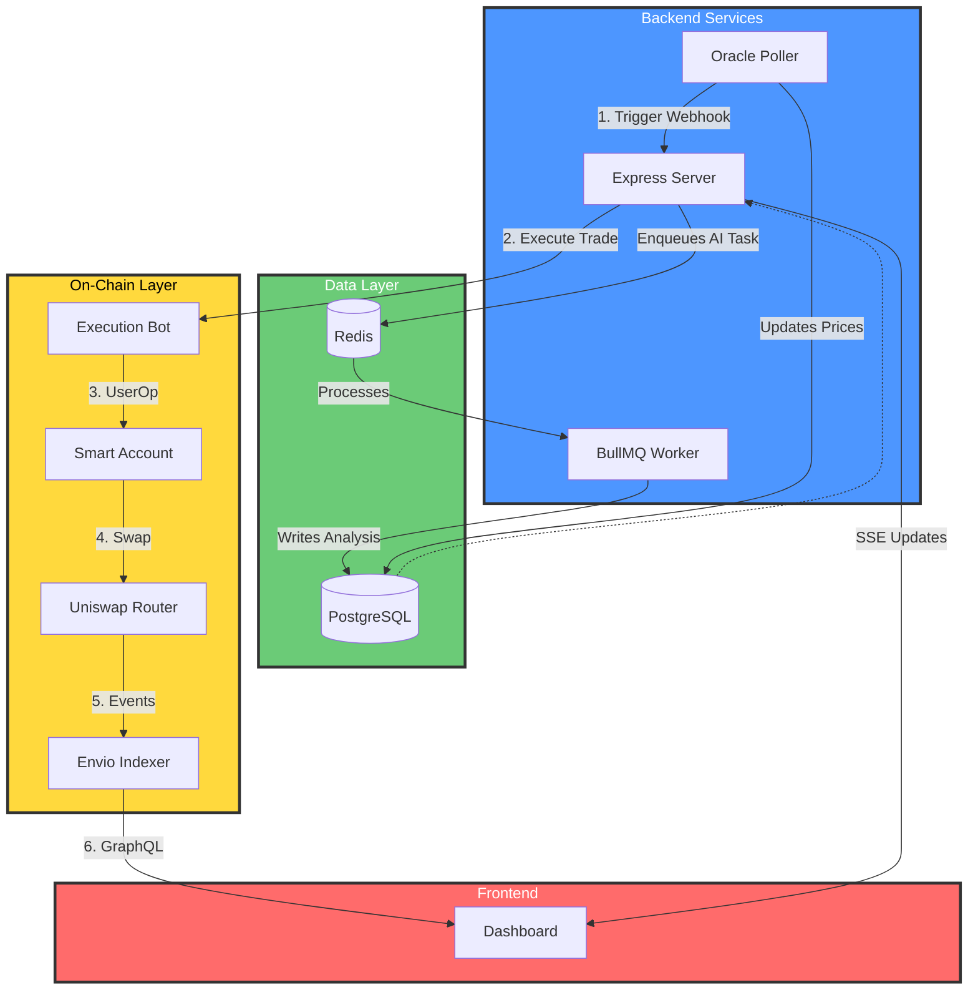

# Drift: Intelligent On-Chain Portfolio Management

[](https://opensource.org/licenses/MIT)
[](https://www.typescriptlang.org/)

**Drift** is an autonomous portfolio management protocol designed for high-performance EVM environments. It combines **ERC-4337 Account Abstraction** and **ERC-7715 Delegation** with AI-driven execution to automate on-chain asset management.

---

## The Goal

The goal is simple: bridge the gap between off-chain intelligence and on-chain execution. Drift allows users to define financial goals, while autonomous agents handle the execution—rebalancing, monitoring, and optimizing portfolios transparently.

---

## Core Capabilities

*   **ERC-7715 Delegation**: Utilizes the new standard for granular permissions, allowing execution bots to rebalance portfolios without having full access to user funds.
*   **Dynamic Allocations**: Users define target percentages (e.g., 40% ETH, 30% USDC, 30% MON), and the system maintains them.
*   **Explainable AI**: Every automated action is backed by an analysis from a memory-equipped agent, explaining exactly *why* a rebalance was triggered.
*   **Dual Price Discovery**: Configurable pricing via **CoinGecko Oracle** or **Uniswap V2 Router** to prevent arbitrage and ensure accurate execution.
*   **Security First**: Built on ERC-4337, ensuring users retain full ownership while delegating specific, scoped actions.
*   **Multi-Chain Support**: Currently deployed and tested on **Monad Testnet** and **Sepolia Testnet**.

---

## Architecture

Drift follows a distributed, event-driven architecture designed for reliability.



---

## Modules

### AI Snapshot Agent
The `SnapshotAgent` is a tool-calling loop powered by **Llama 3.3**.
*   **Memory System**: Maintains context of market conditions to recognize recurring patterns.
*   **Tool-Calling**: Autonomously fetches price data and saves analyses.
*   **Explainability**: Generates human-readable summaries for every action.

### Portfolio Rebalancer
The rebalancing engine calculates portfolio "drift" in real-time.
*   **Smart Thresholds**: Configurable drift thresholds (default 15% for testnets) to prevent over-trading.
*   **Cooldown Protection**: Mandatory cooldowns between rebalances to prevent rapid-fire trading.
*   **Slippage Protection**: Integrated with DEX routers to ensure optimal trade execution.

---

## Tech Stack

| Layer | Technology |
| :--- | :--- |
| **Smart Contracts** | Solidity, Hardhat, OpenZeppelin |
| **Account Abstraction** | ERC-4337, MetaMask Smart Accounts Kit, Permissionless |
| **Delegation** | **ERC-7715** (via MetaMask Delegation Toolkit) |
| **Networks** | **Monad Testnet**, **Sepolia Testnet** |
| **AI / LLM** | Groq SDK, Llama 3.3 (70B) |
| **Backend** | Node.js, TypeScript, Prisma (PostgreSQL) |
| **Task Queue** | BullMQ, Redis |
| **Indexing** | Envio (GraphQL) |

---

## Getting Started

### Prerequisites
*   **Node.js** (v18+)
*   **PostgreSQL**
*   **Redis** (for BullMQ)
*   **Groq API Key** (for AI features)

### Installation
1.  **Clone the repository**:
    ```bash
    git clone git@github.com:jerrygeorge360/Drift.git
    cd Drift
    ```
2.  **Install dependencies**:
    ```bash
    npm install
    ```
3.  **Configure Environment**:
    Create a `.env` file based on `.env.example`.
    *   Set `PRICE_SOURCE=ROUTER` to use on-chain pricing.
    *   Set `CHAIN_ID=10143` for Monad or `11155111` for Sepolia.
4.  **Database Setup**:
    ```bash
    npx prisma migrate dev
    npx prisma generate
    ```

### Running the Services
Drift runs as a distributed system. You can start all services concurrently (API, Worker, Poller) with a single command.

**Note**: Ensure PostgreSQL and Redis are running locally before executing this command.

```bash
npm run dev:all
```
This command will automatically:
1.  Clean the `dist` folder.
2.  Generate Prisma Client.
3.  Build the TypeScript project.
4.  Run database migrations.
5.  Start all services.

### Docker Support

You can run the entire stack (API, Worker, Poller, Postgres, Redis) with a single command:

```bash
docker-compose up --build
```

This will start:
*   **API Server**: `http://localhost:4000`
*   **Prisma Studio**: `http://localhost:5555`
*   **PostgreSQL**: Port `5432`
*   **Redis**: Port `6379`
*   **Worker & Poller**: Background services

---

## Documentation

Comprehensive documentation is available in the `docs/` folder:

### Core Documentation
- **[Project Overview](docs/Project_Overview.md)** - Vision and roadmap
- **[Project Complexity Analysis](docs/Project_Complexity_Analysis.md)** - **MUST READ**: Technical depth and solo developer achievements
- **[Deployment Guide](docs/Deployment_Guide.md)** - Production deployment and operations
- **[API Documentation](docs/API_Documentation.md)** - API reference

### Technical Deep Dives
- **[Rebalancing Engine](docs/Rebalancing_Engine.md)** - Drift detection and trade execution
- **[AI Agent System](docs/AI_Agent_System.md)** - Memory-based AI analysis
- **[Multi-Chain Support](docs/Multi-Chain_Support.md)** - Cross-chain implementation details

---

## Hackathon Achievements

*   **Best AI Agent**: Fully autonomous agent with memory and tool-calling.
*   **Best On-Chain Automation**: True non-custodial automation via delegation.
*   **Most Innovative Delegation**: Leveraging ERC-7715 for DeFi.
*   **Best Use of Envio**: High-performance indexing for real-time portfolio tracking.

---

## License

Distributed under the **MIT License**. See `LICENSE` for more information.
