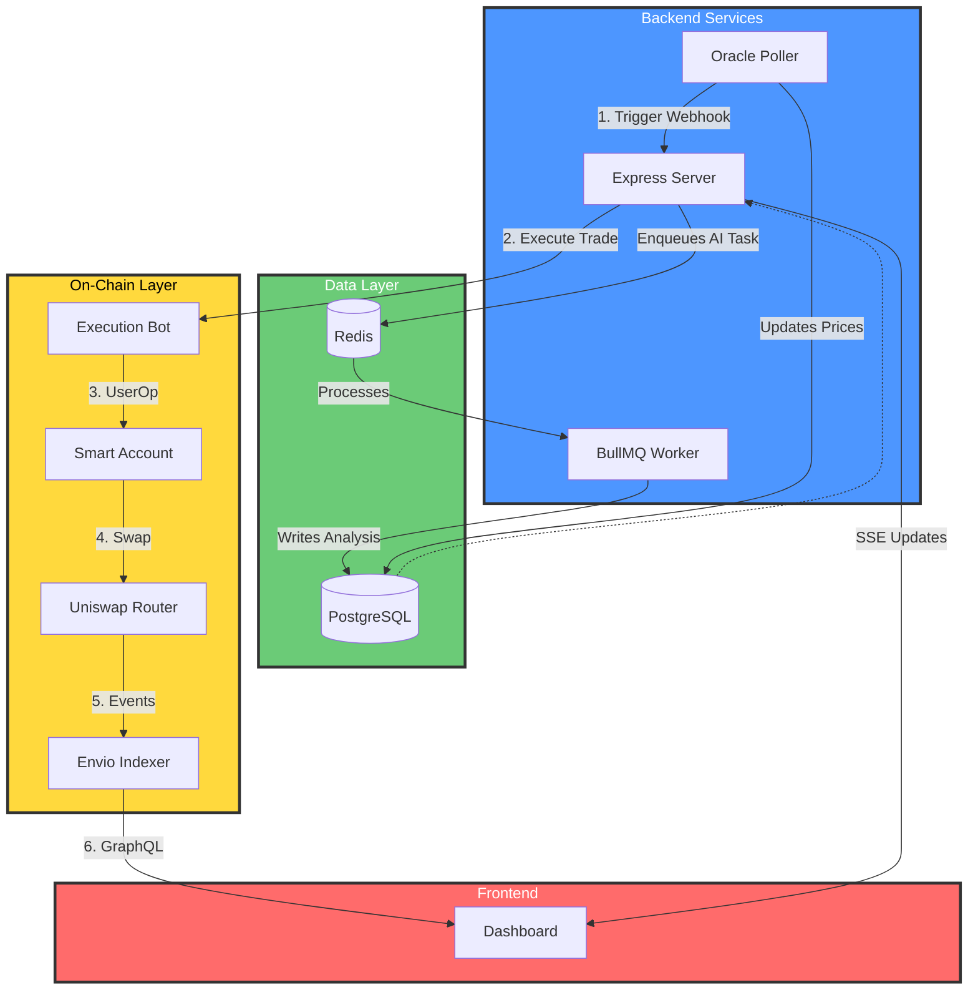

# 🌊 Drift: Intelligent On-Chain Portfolio Management

[](https://opensource.org/licenses/MIT)
[](http://makeapullrequest.com)
[](https://monad.xyz/)

**Drift** is an autonomous portfolio management protocol built for the **Monad ecosystem**. It leverages **MetaMask Smart Accounts (ERC-4337)** and **AI-driven execution** to provide seamless, explainable, and automated on-chain asset management.

---

## 💡 Vision

To redefine decentralized finance by bridging the gap between **AI intelligence** and **on-chain execution**. Drift enables users to set high-level financial goals while autonomous agents handle the complex, manual work of rebalancing, monitoring, and optimizing portfolios—all with 100% transparency and user control.

---

## ✨ Core Capabilities

*   **🧩 Dynamic Allocations**: Define target percentages for your assets (e.g., 40% ETH, 30% USDC, 30% MON).
*   **⚙️ Delegated Automation**: Authorize a secure execution bot to rebalance your portfolio using the **MetaMask Delegation Toolkit**.
*   **🧠 Explainable AI**: Every trade is backed by an AI-generated analysis, explaining *why* a rebalance was triggered.
*   **📊 Real-Time Analytics**: Powered by **Envio** indexing, providing a GraphQL API for deep portfolio insights.
*   **🛡️ Security First**: Built on ERC-4337, ensuring users retain ownership of their funds while delegating specific actions.

---

## 🏗️ Architectural Pattern

Drift follows a **distributed, event-driven architecture** designed for high reliability and scalability.



---

## 🧠 Deep Dive: Modules

### 🤖 AI Snapshot Agent
The `SnapshotAgent` is a tool-calling autonomous loop powered by **Llama 3.3**.
*   **Memory System**: Maintains a historical context of market conditions to recognize recurring patterns.
*   **Tool-Calling**: Can autonomously fetch price data, save detailed analyses, and summarize findings.
*   **Explainability**: Generates human-readable summaries for every automated action.

### ⚖️ Portfolio Rebalancer
The rebalancing engine calculates the "drift" of your portfolio in real-time.
*   **Drift Calculation**: `(Current Value - Target Value) / Target Value`.
*   **Automated Execution**: When drift exceeds a user-defined tolerance (e.g., 5%), the rebalancer generates a sequence of swaps to return the portfolio to its target state.
*   **Slippage Protection**: Integrated with DEX routers to ensure trades are executed at optimal prices.

---

## 🛠 Tech Stack

| Layer | Technology |
| :--- | :--- |
| **Smart Contracts** | Solidity, Hardhat, OpenZeppelin |
| **Account Abstraction** | ERC-4337, MetaMask Smart Accounts Kit, Permissionless |
| **Delegation** | MetaMask Delegation Toolkit |
| **AI / LLM** | Groq SDK, Llama 3.3 (70B), Custom Memory System |
| **Backend** | Node.js, TypeScript, Prisma (PostgreSQL) |
| **Task Queue** | BullMQ, Redis |
| **Indexing** | Envio (GraphQL) |

---

## 🚀 Getting Started

### Prerequisites
*   **Node.js** (v18+)
*   **PostgreSQL**
*   **Redis** (for BullMQ)
*   **Groq API Key** (for AI features)

### Installation
1.  **Clone the repository**:
    ```bash
    git clone https://github.com/your-repo/metasmartport.git
    cd metasmartport
    ```
2.  **Install dependencies**:
    ```bash
    npm install
    ```
3.  **Configure Environment**:
    Create a `.env` file based on `.env.example` and fill in your RPC URLs, private keys, and API keys.
4.  **Database Setup**:
    ```bash
    npx prisma migrate dev
    npx prisma generate
    ```

### Running the Services
Drift runs as a distributed system. You can start all services concurrently:
```bash
npm run dev:all
```
This starts:
*   **Server**: The main API and user interface.
*   **Worker**: Handles background rebalancing and AI tasks.
*   **Poller**: Monitors blockchain state and price feeds.

---

## 📂 Project Structure

```text
src/
├── modules/
│   ├── agent/        # AI Snapshot Agent & Tooling
│   ├── rebalancer/   # Portfolio Drift & Rebalance Logic
│   ├── bot/          # Execution Bot & Delegation Handling
│   └── jobs/         # BullMQ Job Definitions
├── controllers/      # API Endpoints
├── routes/           # Express Routing
├── schema.prisma     # Database Schema
└── server.ts         # Application Entry Point
```

---

## 🏆 Hackathon & Ecosystem Fit

*   **Best AI Agent**: Fully autonomous agent with memory and tool-calling.
*   **Best On-Chain Automation**: True non-custodial automation via delegation.
*   **Most Innovative Delegation**: Leveraging MetaMask's latest delegation features for DeFi.
*   **Best Use of Envio**: High-performance indexing for real-time portfolio tracking.

---

## ⚖️ License

Distributed under the **MIT License**. See `LICENSE` for more information.
