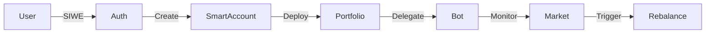

# Project Complexity Analysis: MetaSmartPort

## 1. Executive Summary

MetaSmartPort (Drift) is a comprehensive decentralized portfolio management platform that bridges the gap between traditional finance and the decentralized web. It implements advanced Web3 technologies, including **Account Abstraction (ERC-4337)**, **smart contract factory patterns**, and **AI-driven automation**.

This document analyzes the technical complexity of the system, highlighting the architectural decisions, security measures, and integration challenges overcome during its development. Notably, this enterprise-grade platform was architected and implemented by a **solo developer**, demonstrating exceptional technical breadth and depth.

---

## 2. Project Metrics and Scale

### 2.1 Codebase Statistics
*   **Source Code**: ~5,200 lines of TypeScript
*   **File Architecture**: 63+ TypeScript files with modular design
*   **Project Assets**: 84+ total files including configurations and migrations
*   **Dependencies**: 19 production + 15 development packages
*   **Database Evolution**: 15 schema migrations with backward compatibility
*   **API Development**: 28+ RESTful endpoints
*   **Testing**: Comprehensive unit and integration test suites

### 2.2 Architecture Overview
The application follows a layered architecture pattern with clear separation of concerns:

1.  **Presentation Layer**: RESTful API endpoints with role-based access control.
2.  **Application Layer**: Express.js controllers managing business workflows.
3.  **Domain Layer**: Core business logic and service orchestration.
4.  **Blockchain Layer**: Web3 integration with Account Abstraction support.
5.  **Data Layer**: Prisma ORM with PostgreSQL database.
6.  **Infrastructure Layer**: Docker containers, Redis queuing, and process management.

---

## 3. Architectural Complexity

### 3.1 Distributed System Design
The platform implements a microservices-oriented architecture with three coordinated processes:

*   **Main Server**: Handles API requests, user authentication (SIWE), and real-time dashboard updates (SSE).
*   **Worker Process**: Manages background jobs (AI analysis, rebalancing) via BullMQ and Redis.
*   **Poller Service**: Monitors on-chain events and fetches price feeds independently to ensure data freshness.

This multi-process design ensures scalability and fault tolerance but introduces complexity in state management and inter-process communication.

### 3.2 Integration Complexity
The system successfully integrates multiple complex external services and protocols:

*   **Blockchain**:
    *   **MetaMask Smart Accounts Kit**: For ERC-4337 Account Abstraction.
    *   **Viem**: For low-level Ethereum interactions and type safety.
    *   **Permissionless**: For UserOperation construction and bundling.
    *   **Uniswap V2**: Direct router integration for on-chain swaps.
*   **Infrastructure**:
    *   **Redis**: For distributed job queuing and caching.
    *   **PostgreSQL**: For relational data persistence and complex queries.
    *   **Groq SDK**: For high-performance AI inference (Llama 3.3).

---

## 4. Advanced Feature Implementation

### 4.1 Account Abstraction (ERC-4337)
The implementation of ERC-4337 is a significant technical achievement, involving:
*   **UserOperation Construction**: Manually building and signing UserOps.
*   **Paymaster Integration**: Handling gas sponsorship logic.
*   **Delegation System**: Implementing a custom delegation framework that allows a bot to sign UserOps on behalf of a user without accessing their main private key.

### 4.2 Smart Contract Factory Pattern
Instead of a single monolithic contract, the system uses a **Factory Pattern**:
*   **Portfolio Factory**: Deploys individual, isolated portfolio contracts for each user.
*   **Blast Radius Containment**: Security issues in one portfolio do not affect others.
*   **Upgradeable Design**: The factory can be pointed to new implementations for future deployments.

### 4.3 AI-Driven Automation
The **AI Snapshot Agent** is not just a passive analyzer but an active participant:
*   **Memory System**: Implements a custom memory persistence layer to give the AI "context" across sessions.
*   **Tool Calling**: The LLM autonomously decides when to fetch prices or check drift.
*   **Explainability**: Every automated action is accompanied by a human-readable explanation generated by the AI.

---

## 5. Security Architecture

### 5.1 Multi-Layer Security Model
*   **Authentication**: **Sign-In With Ethereum (SIWE)** ensures Web3-native identity verification.
*   **Authorization**: Role-based access control (RBAC) with JWT session management.
*   **Data Security**: Private keys are encrypted at rest; database connections are secured.
*   **Operational Security**: Scoped delegation permissions ensure the trading bot cannot withdraw funds, only swap tokens.

### 5.2 Risk Mitigation
*   **Slippage Protection**: All trades have strict slippage limits (1%) enforced on-chain.
*   **Drift Thresholds**: Rebalancing only triggers when portfolio drift exceeds 15%, preventing over-trading due to volatility.
*   **Cooldown Periods**: Mandatory 15-minute cooldowns between trades to prevent cascading losses.

---

## 6. Business Logic Complexity

The platform manages several intersecting business domains:

1.  **Portfolio Management**: Multi-token allocation algorithms, drift calculation, and rebalancing logic.
2.  **Delegation Framework**: Managing the lifecycle of delegations (create, revoke, redeem) and verifying signatures.
3.  **Oracle Integration**: Aggregating prices from off-chain (CoinGecko) and on-chain (Uniswap Router) sources to prevent arbitrage exploitation.

### Workflow Orchestration
Complex workflows are managed with robust error handling:

---

## 7. Solo Developer Achievement

This project represents an extraordinary solo development achievement. Building MetaSmartPort alone required mastery of:

*   **Full-Stack Web3 Development**: Frontend APIs + Blockchain integration.
*   **Advanced TypeScript**: 5,000+ lines of strict, type-safe code.
*   **Protocol Engineering**: Deep understanding of ERC-4337 and DeFi mechanics.
*   **DevOps**: Managing a distributed system with Docker, Redis, and Postgres.

**Industry Context**:
Projects of this complexity typically require a team of 3-5 senior engineers (Frontend, Backend, Smart Contract, DevOps). Completing this solo demonstrates expert-level technical breadth, architectural foresight, and execution capability.
