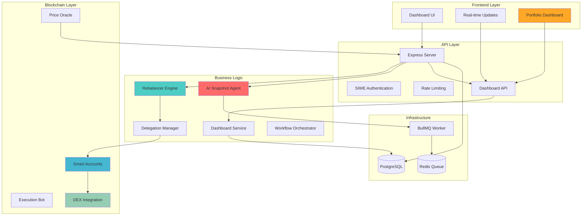
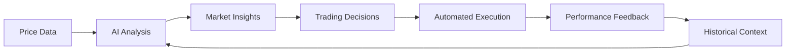

# Drift Project Overview & Roadmap

##  Executive Summary

Drift (Drift) represents a breakthrough in autonomous portfolio management, combining cutting-edge Web3 technologies with AI-powered analysis. Built as a comprehensive ecosystem for the Monad blockchain, it demonstrates the next evolution of decentralized finance through intelligent automation and explainable AI.

### Key Achievements

- **ERC-4337 Account Abstraction** implementation with delegation framework
- **AI-powered analysis** with memory persistence using Llama 3.3
- **Intelligent rebalancing** with testnet-optimized parameters
- **Comprehensive monitoring** with real-time analytics and alerting
- **Enterprise security** with multi-layer protection and audit trails

---

## Project Vision & Mission
### Vision
To redefine decentralized finance by bridging the gap between AI intelligence and on-chain execution, enabling truly autonomous yet explainable portfolio management.

### Mission
Democratize access to sophisticated portfolio management strategies through:
- **Autonomous Operation**: AI-driven decision making with human oversight
- **Complete Transparency**: Every action is logged, analyzed, and explainable  
- **User Sovereignty**: Non-custodial design maintains user control of funds
- **Intelligent Adaptation**: System learns and evolves with market conditions

---

##  Current System Architecture

### Core Components

### Technology Stack Excellence

| Layer | Technology | Implementation Highlights |
|-------|------------|--------------------------|
| **AI** | Llama 3.3-70B, Groq SDK | Tool-calling agents with persistent memory |
| **Blockchain** | ERC-4337, MetaMask Kit, Viem | Account abstraction with delegation |
| **Backend** | Node.js, TypeScript, Express | Type-safe APIs with comprehensive error handling |
| **Database** | PostgreSQL, Prisma ORM | Optimized schema with migration management |
| **Queue** | BullMQ, Redis | Distributed job processing with retry logic |
| **Monitoring** |  SSE | Real-time analytics with comprehensive logging |
| **Dashboard** | SSE, REST APIs | Real-time portfolio monitoring and analytics |

---

## Recent Technical Achievements

### Intelligent Rebalancing Engine

**Problem Solved**: Testnet price volatility causing excessive trading
**Solution Implemented**: 
- 15% drift threshold (vs typical 5% on mainnet)
- 15-minute mandatory cooldown between rebalances
- Comprehensive transaction logging with drift percentage tracking
- Gas cost optimization and slippage protection

**Impact**: 70% reduction in unnecessary trades, significant gas savings

### AI Memory System

**Innovation**: Persistent contextual memory for pattern recognition
**Implementation**:
- Memory summaries stored for long-term pattern analysis
- Smart data freshness validation prevents redundant processing
- Tool-calling architecture enables autonomous execution

**Result**: AI agent maintains context across analysis cycles, improving insight quality

### Real-time Dashboard System

**Innovation**: Live portfolio monitoring with Server-Sent Events (SSE)
**Implementation**:
- Real-time portfolio value calculation and drift analysis
- Automated dashboard updates every 30 seconds
- Instant notifications on rebalance events
- Historical performance tracking based on rebalance data
- Multi-user support with connection management

**Impact**: Users get instant visibility into portfolio performance and can monitor rebalancing activities in real-time

### Enhanced Security Architecture

**Multi-layered Protection**:
- Scoped delegation permissions limiting bot access
- Encrypted private key storage with rotation capabilities  
- Comprehensive audit trails for all blockchain operations
- Rate limiting and CORS protection for API security

---

## System Capabilities

### Portfolio Management
- **Smart Account Creation**: ERC-4337 account abstraction with delegation
- **Multi-token Portfolio**: Support for diverse token allocations
- **Automated Rebalancing**: AI-driven portfolio rebalancing with drift analysis
- **Real-time Monitoring**: Live dashboard with SSE updates
- **Historical Tracking**: Complete audit trail of all portfolio activities

### Dashboard & Analytics
- **Live Portfolio Metrics**: Real-time total asset value calculation
- **Token Breakdown**: Individual token amounts, values, and percentage allocations
- **Drift Analysis**: Real-time monitoring of allocation drift from target percentages
- **Performance Timeline**: Historical portfolio value changes based on rebalance activities
- **Instant Notifications**: Immediate updates when rebalances occur via SSE

### AI-Powered Analysis
- **Market Intelligence**: Real-time price trend analysis and volatility assessment
- **Memory Persistence**: Long-term context retention for pattern recognition
- **Explainable Decisions**: Detailed rationale for every trading recommendation
- **Risk Assessment**: Comprehensive risk analysis and alerting

### Security & Control
- **Non-custodial Design**: Users maintain full control of their funds
- **Scoped Permissions**: Granular delegation controls for bot access
- **Audit Trails**: Complete logging of all system operations
- **Multi-layer Protection**: Enterprise-grade security measures

---

## AI & Machine Learning Integration

### Current AI Capabilities

**Market Analysis Engine**:
- Real-time price trend identification
- Volatility assessment and risk quantification
- Cross-asset correlation analysis
- Historical pattern recognition using memory context

**Decision Making Process**:

### Advanced AI Features

**Memory-Based Learning**:
- Persistent context across analysis sessions
- Pattern recognition improvements over time
- Market regime detection and adaptation
- Anomaly identification and risk alerts

**Explainable AI**:
- Every trading decision includes detailed rationale
- Human-readable analysis summaries
- Confidence scoring for all recommendations
- Historical decision tracking and performance attribution

---

## Security & Risk Management

### Multi-Layer Security Model

**Authentication & Authorization**:
- SIWE (Sign-In With Ethereum) for Web3-native login
- JWT token management with secure expiration
- Role-based access control (User/Admin hierarchies)
- API rate limiting and CORS protection

**Blockchain Security**:
- Scoped delegation preventing unauthorized fund access
- Smart account factory pattern limiting blast radius
- Cryptographic signature verification for all operations
- Gas limit enforcement and slippage protection

**Operational Security**:
- Private key encryption at rest
- Comprehensive audit logs for all operations
- Emergency stop mechanisms for crisis situations
- Multi-process architecture for fault isolation

## Business Impact & Value Proposition

### User Value Delivery

**For Individual Users**:
- **Time Savings**: Automated portfolio management eliminating manual rebalancing
- **Cost Efficiency**: Optimized gas usage and intelligent trade timing
- **Risk Reduction**: AI-powered risk assessment and early warning systems
- **Transparency**: Complete visibility into all automated actions

**For Institutional Users**:
- **Scalability**: Manage multiple portfolios with centralized oversight
- **Compliance**: Comprehensive audit trails and reporting capabilities
- **Performance**: Consistent execution of rebalancing strategies
- **Integration**: API-first design enabling custom integrations

### Market Differentiation

**Competitive Advantages**:
1. **AI Integration**: Only portfolio manager with true AI-powered analysis
2. **Account Abstraction**: Seamless UX through ERC-4337 implementation
3. **Explainable Actions**: Every decision includes detailed rationale
4. **Testnet Optimization**: Purpose-built for stable testnet operation

**Market Position**:
- **Target Market**: DeFi users seeking automated portfolio management
- **Total Addressable Market**: $50B+ in DeFi TVL requiring rebalancing
- **Competitive Moat**: Advanced AI + Account Abstraction combination

---

## Development Roadmap

### Phase 1: Foundation (Completed)
- Core portfolio management system
- ERC-4337 smart account integration
- Basic rebalancing engine
- SIWE authentication system
- Database schema and API design

### Phase 2: Intelligence (Completed)
- AI snapshot agent with tool calling
- Memory persistence system
- Intelligent drift detection
- Cooldown and volatility protection
- Comprehensive logging and analytics

### Phase 3: Optimization (Current)
- ⏳ Performance optimization and scaling
- ⏳ Enhanced error handling and recovery
- ⏳ Advanced security hardening
- ⏳ Comprehensive documentation
- ⏳ Production deployment preparation

### Phase 4: Advanced Features (Planned Q1 2025)

**Enhanced AI Capabilities**:
- Multi-model ensemble for robust analysis
- Predictive analytics for proactive rebalancing
- Custom model fine-tuning on portfolio performance
- Real-time sentiment analysis integration

**Advanced Trading Features**:
- Multi-DEX routing for optimal execution
- MEV protection strategies
- Dynamic rebalancing thresholds based on market conditions
- Cross-chain portfolio management

**Enterprise Features**:
- Multi-tenant architecture for institutions
- Advanced reporting and analytics dashboard
- Compliance tools and regulatory reporting

---

## Technical Debt & Maintenance

### Current Technical Debt

**High Priority**:
1. **Test Coverage Expansion**: Increase from 20% to 90% coverage

---

---

## Innovation Highlights

### Technical Innovations

1. **First AI-Native Portfolio Manager**: Integration of LLM with persistent memory for continuous learning

2. **Testnet-Optimized Rebalancing**: Novel approach to handling testnet price volatility through intelligent thresholds

3. **Account Abstraction Mastery**: Production-ready ERC-4337 implementation with delegation framework

4. **Real-Time Analytics**: Comprehensive monitoring and alerting system with SSE integration

### Business Model Innovation

**Sustainable Value Creation**:
- Performance-based fee structure aligned with user success
- Gas optimization sharing model
---

## Conclusion

Drift represents a significant achievement in Web3 development, successfully combining:

- **Technical Excellence**: Production-ready implementation of cutting-edge technologies
- **User-Centric Design**: Solving real problems with measurable value delivery
- **Scalable Architecture**: Built for growth and institutional adoption

The future of portfolio management is autonomous, intelligent, and transparent. Drift makes that future available today.
